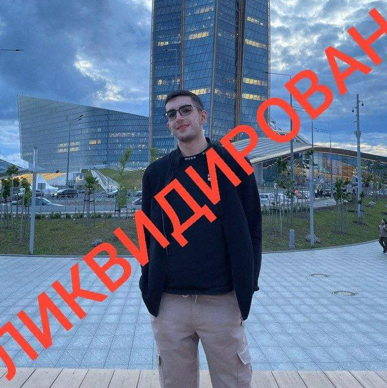
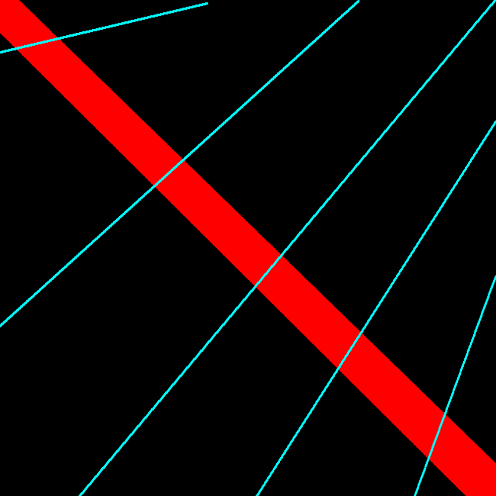
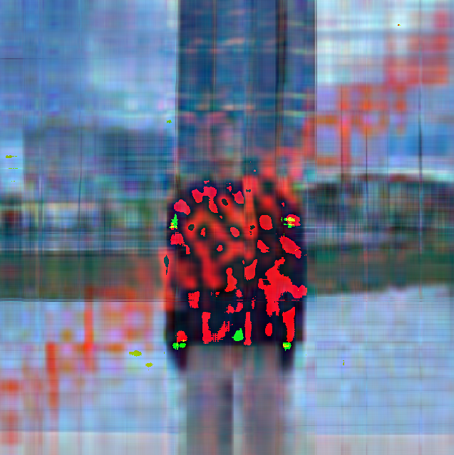
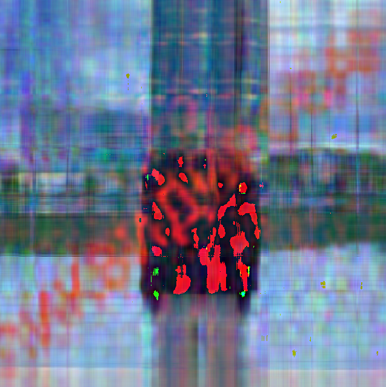
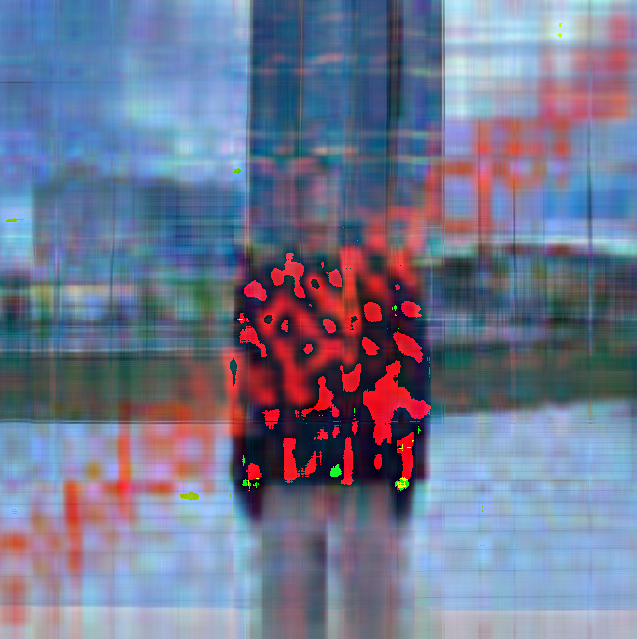
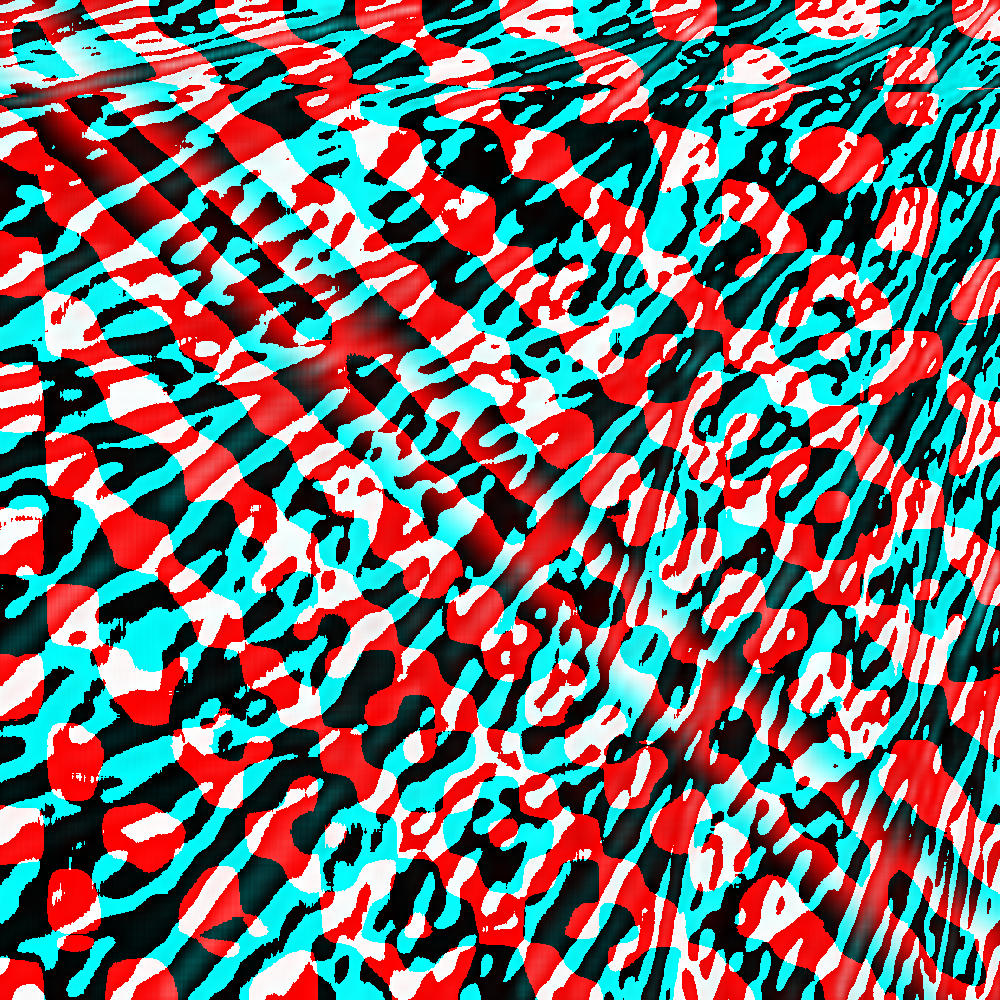
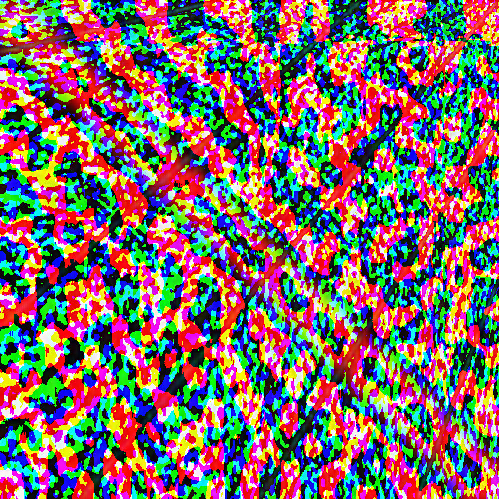
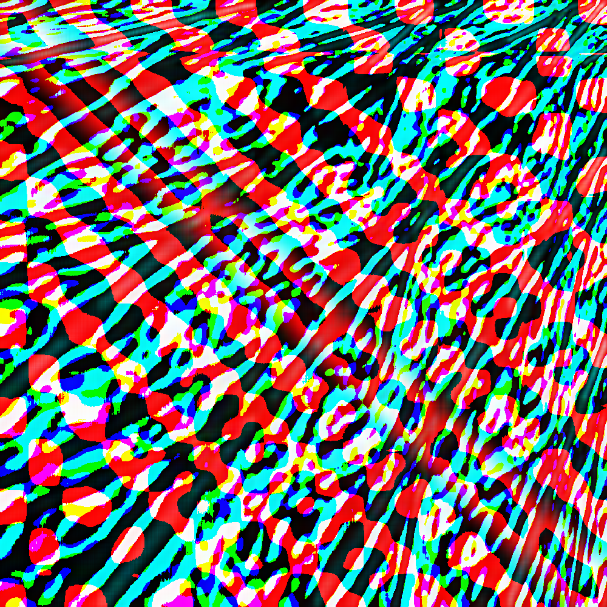
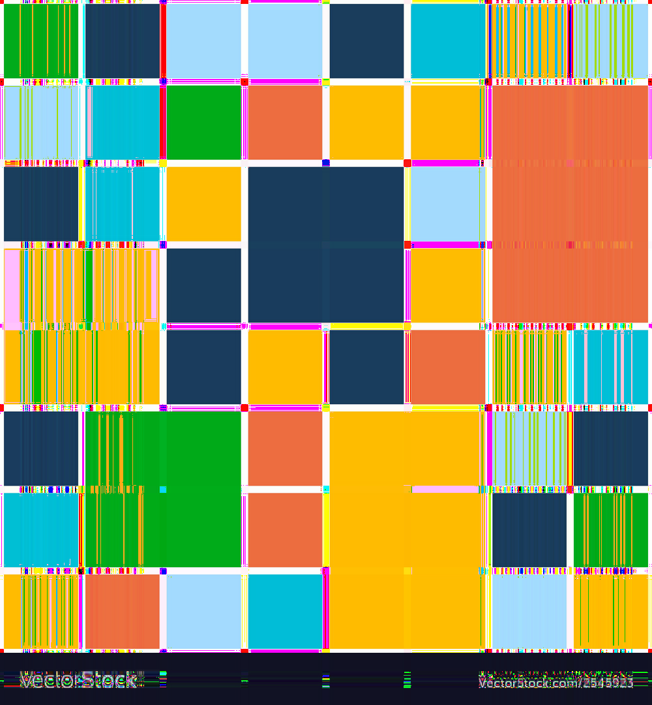
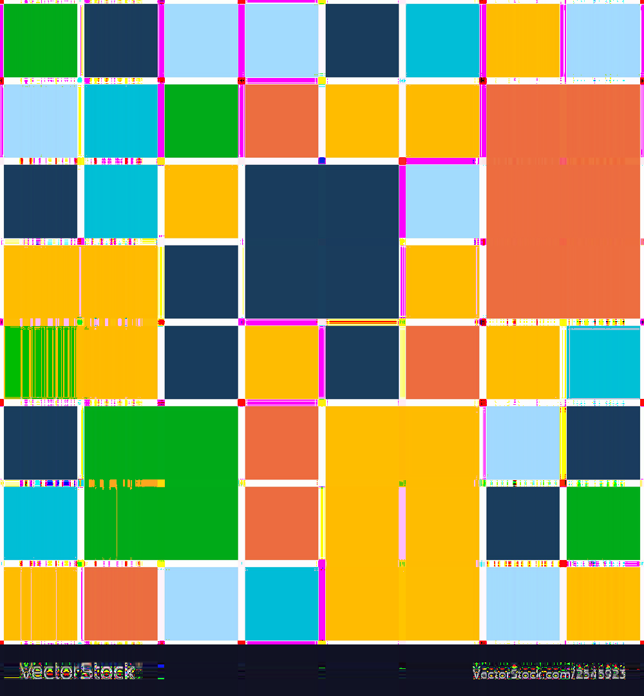

# Задача 3. Сингулярное разложение и сжатие изображений

## Часть I

Реализуйте программу на языке Python, которая производит сжатие изображения в формате bmp (24
бита на цвет) с минимизацией потери качества при фиксированном ограничении на размер сжатого
файла, используя теорию малоранговых приближений. Ваша программа должна семантически
распадаться на две единицы логики: формирование промежуточного представления на основе
исходного изображения, а также восстановление, использующее промежуточное представление.

Для хранения промежуточного сжатого представления используйте собственный формат файла; его
размер (включая область метаданных) должен быть в хотя бы в N раз меньше исходного, где N –
настраиваемый параметр. Напишите краткую документацию предложенного вами формата и
приложите её к решению задачи.

Сингулярное разложение реализуйте тремя способами:

- пользуясь стандартными библиотеками
- с помощью самописного примитивного алгоритма
- “максимально хорошим” численным методом, который у вас получится написать

Формальные требования:

Программе передаются следующие аргументы командной строки:

* `--mode=<mode>` – может быть compress или decompress
  * `--mode=compress` – программа преобразует изображение в промежуточное представление
  * `--mode=decompress` – программа восстанавливает изображение из промежуточного представления

* `--method=<method>` (есть, если `--mode=compress`) – задаёт способ сингулярного разложения:
  * `--method=numpy` – для сингулярного разложения используется numpy
  * `--method=simple` – для сингулярного разложения используется примитивный алгоритм
  * `--method=advanced` – для сингулярного разложения используется максимально “хороший” численный метод

* `--compression=<N>` (есть, если `--mode=compress`) – число раз, в которое размер исходного изображения должен быть
  больше размера промежуточного представления: (размер изображения) / (размер пром. представления) >= N

* `--in_file=<path>` – путь до преобразуемого файла
  * Если `--mode=compress` – путь до исходного изображения
  * Если `--mode=decompress` – путь до промежуточного представления

* `--out_file=<path>` – файл с результатом
  * Если `--mode=compress` – файл, в который будет выводиться промежуточное представление
  * Если `--mode=decompress` – файл, в который будет выводиться восстановленное изображение

## Часть II

Подберите достаточно большое изображение, на котором будет (насколько это возможно видна)
разница в сохранности или потере ключевых признаков при его сжатии в одинаковое количество
раз при использовании различных реализаций SVD.

Возможно, эта задача не решится путём подбора изображения. Тогда следует отталкиваться от того,
какие матрицы каким алгоритмом лучше обрабатывать. То есть рассматривать матрицу как
первичный объект, а построенное на его основе изображение — как вторичный. Ещё можно
наложить дополнительные ограничения: например, предоставить различным алгоритмам
одинаковое время работы.

# Сохраняемый формат

Сжатые файлы сохраняются в следующем виде:

Пусть `R`, `G`, `B` -- каналы изображения, заданные матрицами размера `n x m`. Тогда при помощи SVD изображение можно
представить шестью матрицами:

```
R = U_R @ np.diag(S_R) @ V_R
G = U_G @ np.diag(S_G) @ V_G
B = U_B @ np.diag(S_B) @ V_B
```

Матрицы `U` имеют размерность `n x k`, `S` -- вектор из сингулярных чисел длинны `k`, `V` -- матрицы `k x m`,
где `k = min(m, n)`

Тогда сохраняемый файл имеет следующий вид:

Первые 12 байт -- последовательно записанные числа `m, k, n`. Далее последовательно в порядке `R, G, B` записапы матрицы
сингулярного разложения в порядке `U, S, V`.

# Эксперименты

В качестве тестовых изображений были выбраны следующие:

| Рафик                                      | Квадраты                                     | Линии                                      |
|--------------------------------------------|----------------------------------------------|--------------------------------------------|
|  |  |  |

Использовались следующие алгоритмы:

1. Библиотечный алгоритм Numpy
2. Power Iterations
3. Block Power SVD

Для Block Power SVD параметр `tolerance`, отвечающий за пороговую величину ошибки `err = ||A - U @ np.diag(S) @ V||`был
выбран равным 1000.

Сжатие производилось с параметром `--compression = 4`, т. е. в 4 раза по сравнению с исходным изображением.

## Результаты

| Оригинал                                     | Numpy                                                         | Power Iterations                                               | Block Power SVD                                                  |
|----------------------------------------------|---------------------------------------------------------------|----------------------------------------------------------------|------------------------------------------------------------------|
|    |    |    |    | 
|    |    |    |    | 
|  |  |  |  |

## Выводы

1. Алгоритмы Numpy и Block Power SVD с `tolerance = 1000` показали очень схожие результаты. 
2. На изображении Рафика Power Iterations почти лишил его очертаний головы, но оставил начало слова ЛИКВИДИРОВАН более читаемым, чем алгоритмы Numpy и Block Power SVD.
3. На изображении линий все алгоритмы дали плохие результаты. Вероятно, это связано с большим количеством нулей в строках матриц каналов изображения. Power Iterations отработал хуже всего, алгоритмы Numpy и Block Power SVD смогли сохранить цвета исходного изображения.
4. На кубах лучше всего отработал метод Numpy. Block Power SVD не сильно отстает от него, однако он перекрасил один квадрат не в тот цвет. На изображении, сжатом алгоритмом Power Iterations, присуствуют мноржественные дефектные линии.

Учитывая, что Numpy работает в разы быстрее других алгоритмов, предпочтительнее использовать именно его, а не самоприсные алгоритмы (по крайней мере, рассмотренные в этой работе)