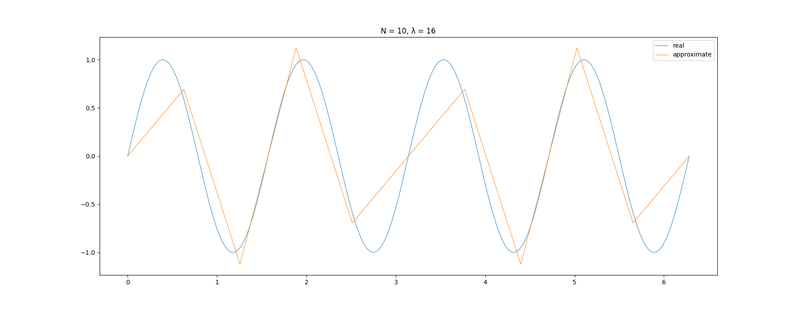
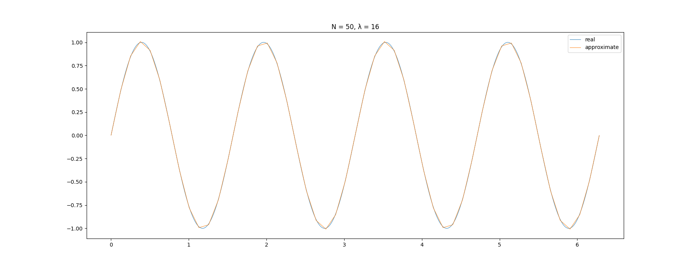
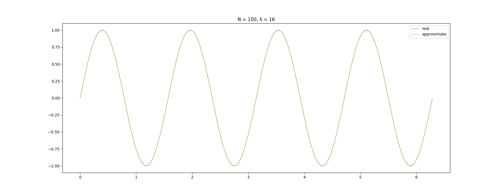
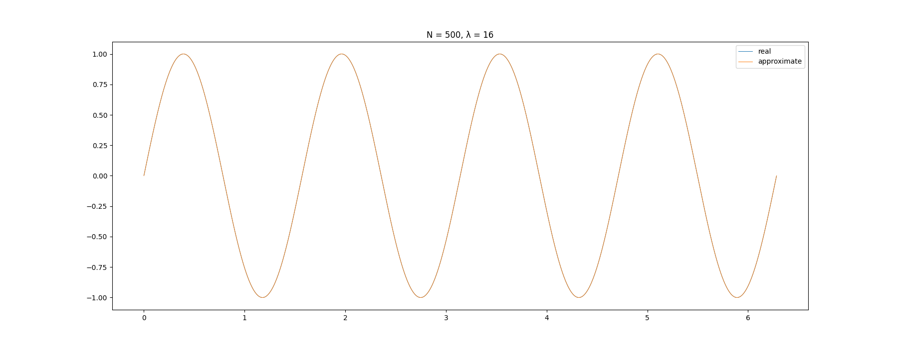

# Задача 4. Метод конечных элементов

Среди довольно широкого класса задач, которые носят общее название “краевая задача для уравнения теплопроводности”, можно указать некоторые частные случаи, когда решение может быть построено явно. Одним из таких случаев является задача Штурма-Лиувилля с нулевым потенциалом.

Необходимо построить приближённое решение этой краевой задачи методом конечных элементов с кусочно-линейными базисными функциями. Проведите численный эксперимент, исследующий порядок сходимости метода к точному решению. Подтверждается ли теоретическая оценка о втором порядке сходимости?

~~Желательно максимально, насколько это возможно, распараллелить вычисления по данным. Оцените эффективность распараллеливания.~~

# Начальные условия

В качестве решаемой задачи возьмем:

* $y'' - \lambda y = -2\lambda\sin(\sqrt{\lambda}x), ~~ 0 \leq x \leq 2\pi$
* $y(0) = y(2\pi) = 0$

Решением является следующая функция:

* $y = \sin(\sqrt{\lambda}x)$

Из решения видно, что подходят только те значения $\lambda$, при которых $\sqrt{\lambda}l = \in n, ~~n \in \mathbb{Z}$, так как $\sin(x) = 0$ тогда и только тогда, когда $x = \pi n, ~~n \in \mathbb{Z}$

Задача Штурма-Лиувилля задается в следующем виде:

* $(p(x)y')' - q(x)y = -f(x), ~~0 \leq x \leq l$
* $y(0) = y(l) = 0$

Для данного конкретного случая:

* $p(x) = 1$
* $q(x) = \lambda$
* $f(x) = 2\lambda\sin(\sqrt{\lambda}x)$

# Аппроксимация и оценка качества

Положим, что задана равномерная сетка с шагом `h` и количеством сегментов `N` (количество узлов равно `N + 1`). Будем аппроксимировать при помощи кусочно-линейных базисных функций (полиномов первого порядка). Пусть $u(x)$ -- полученная аппроксимирующая функция. Тогда в качестве теоретической оценки качества воспользуемся следующим неравенством со страницы 98 [крутой книжки](http://www.ict.nsc.ru/matmod/files/textbooks/KhakimzyanovCherny-2.pdf):

* $\lvert \lvert y(x) - u(x) \rvert \rvert _{L_2(0, l)} \leq (c'c)^2 h^2 \lvert \lvert f \rvert \rvert _{L_2(0, l)}$

Распишем составляющие этого неравенства:

* $||f(x)||_{L_2(0, l)} = \sqrt{\displaystyle\int_0^l{f^2(x)dx}}$
* $c_1 = \inf{p(x)} = 1$
* $P = \sup{p(x)} = 1$
* $P_1 = \max{p'(x)} = 0$
* $Q = \sup{q(x)} = \lambda$
* $J_M = \sup{\displaystyle\frac{dx}{d\xi}x(\xi)}$, где $x(\xi)$ -- гладкая функция, отображающая равномерную сетку с отрезка $[0, 1]$ в сетку с отрезка $[0, l]$. Так как наша сетка равномерная, то отображение $x(\xi)$ является линейным, и $x(\xi) = l\xi$ в общем случае, и $x(\xi) = 2\pi\xi$ в нашем конкретном. Отсюда $J_M = l = 2\pi$
* $c' = J_M\sqrt{P + \displaystyle\frac{Ql^2}{4}} = 2\pi\sqrt{1 + \lambda\pi^2}$
* $c = \displaystyle\frac{1}{c_1}((Q \displaystyle\frac{l}{2} + P_1)\displaystyle\frac{l}{2c_1} + 1) = \lambda\pi^2 + 1$

Хотя параметр $l$ в равенствах выше задан явно, реализация поддерживает выбор произвольного параметра $l$, такого что $y(l) = 0$. При этом соответствующие, описанные выше ограничения, описанные выше, накладываются и на параметр $\lambda$.

Для оценки качества выбиралась следующая стратегия: считался оценка `estimate` по формуле $\lvert \lvert y(x) - u(x)\rvert \rvert _{L_2(0, l)} - (c'c)^2h^2\lvert \lvert f \rvert \rvert _{L_2(0, l)}$. Если `estimate <= 0`, то теоретическая оценка сходимости подтверждается, в ином случае опровергается.

# Эксперимент

Для эксперимента были выбраны следующие значения параметров:

* `N = [10, 50, 100, 500, 1000, 5000, 10_000]`
* `λ = [0.25, 1, 4, 16, 25, 100]`

После запуска алгоритма были получены следующие результаты:

```
N =    10 | λ = 0.25 | Estimate = -575.7968
N =    10 | λ =    1 | Estimate = -70952.1200
N =    10 | λ =    4 | Estimate = -14657333.5677
N =    10 | λ =   16 | Estimate = -3547547048.6971
N =    10 | λ =   25 | Estimate = -21001648837.6683
N =    10 | λ =  100 | Estimate = -5327740584221.5439
N =    50 | λ = 0.25 | Estimate = -23.0319
N =    50 | λ =    1 | Estimate = -2838.0848
N =    50 | λ =    4 | Estimate = -586293.3432
N =    50 | λ =   16 | Estimate = -141901881.9543
N =    50 | λ =   25 | Estimate = -840065953.5378
N =    50 | λ =  100 | Estimate = -213109623368.7643
N =   100 | λ = 0.25 | Estimate = -5.7580
N =   100 | λ =    1 | Estimate = -709.5212
N =   100 | λ =    4 | Estimate = -146573.3358
N =   100 | λ =   16 | Estimate = -35475470.4886
N =   100 | λ =   25 | Estimate = -210016488.3846
N =   100 | λ =  100 | Estimate = -53277405842.1933
N =   500 | λ = 0.25 | Estimate = -0.2303
N =   500 | λ =    1 | Estimate = -28.3808
N =   500 | λ =    4 | Estimate = -5862.9334
N =   500 | λ =   16 | Estimate = -1419018.8196
N =   500 | λ =   25 | Estimate = -8400659.5354
N =   500 | λ =  100 | Estimate = -2131096233.6878
N =  1000 | λ = 0.25 | Estimate = -0.0576
N =  1000 | λ =    1 | Estimate = -7.0952
N =  1000 | λ =    4 | Estimate = -1465.7334
N =  1000 | λ =   16 | Estimate = -354754.7049
N =  1000 | λ =   25 | Estimate = -2100164.8838
N =  1000 | λ =  100 | Estimate = -532774058.4219
N =  5000 | λ = 0.25 | Estimate = -0.0023
N =  5000 | λ =    1 | Estimate = -0.2838
N =  5000 | λ =    4 | Estimate = -58.6293
N =  5000 | λ =   16 | Estimate = -14190.1882
N =  5000 | λ =   25 | Estimate = -84006.5954
N =  5000 | λ =  100 | Estimate = -21310962.3369
N = 10000 | λ = 0.25 | Estimate = -0.0006
N = 10000 | λ =    1 | Estimate = -0.0710
N = 10000 | λ =    4 | Estimate = -14.6573
N = 10000 | λ =   16 | Estimate = -3547.5470
N = 10000 | λ =   25 | Estimate = -21001.6488
N = 10000 | λ =  100 | Estimate = -5327740.5842
```

Для всех комбинаций входных пар наборов `estimate` оказался отрицательным, что подтверждает теоретическую оценку о скорости сходимости метода конечных элементов.

# Метод конечных элементов наглядно

Парочка примеров улучшения качества аппроксимации с увеличением параметра `N`

## `N = 10`



## `N = 50`



## `N = 100`



## `N = 500`

